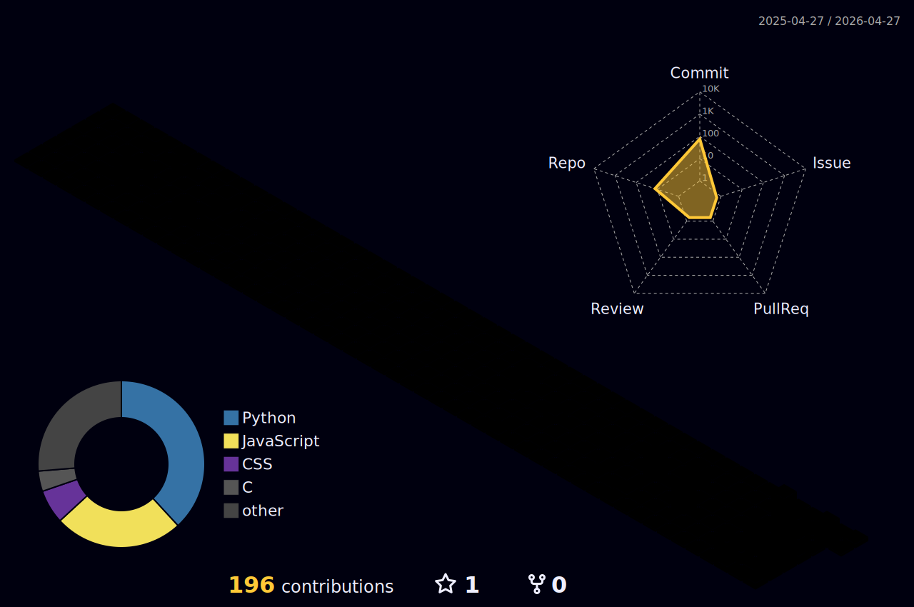

<!-- ============================================================ -->
<!-- 🌌  GILAD HEITNER · GITHUB PROFILE                            -->
<!-- Auto-updates on every push (.github/workflows/*.yml)         -->
<!-- ============================================================ -->

<!-- 🌠 Animated gradient header -->
<p align="center">
  
</p>

<!-- ⌨️ Typing animation -->
<p align="center">
  <a href="https://github.com/GiladHeitner">
    
  </a>
</p>

<!-- 🔗 Social badges -->
<p align="center">
  <a href="https://giladheitner.github.io/">
    
  </a>
  <a href="https://www.linkedin.com/in/gilad-heitner-0253a3293/">
    
  </a>
  <a href="https://github.com/GiladHeitner">
    
  </a>
  
</p>

<!-- 🌈 Animated divider -->
<p align="center"></p>

##  &nbsp; About Me

```ts
const gilad = {
  role:       "Software Engineer",
  education:  "B.S. Computer Science @ Washington State University",
  focus:      ["distributed systems", "applied AI", "developer tooling"],
  builds:     ["real-time chat servers", "load balancers in C",
               "AI agents", "spreadsheet engines"],
  currently:  "shipping end-to-end from C sockets up to LLM pipelines",
  funFact:    "most of this started as a late-night curiosity that got out of hand 🌙",
};
```

> 🌐 Portfolio → **[giladheitner.github.io](https://giladheitner.github.io/)**  
> 💼 LinkedIn → **[gilad-heitner](https://www.linkedin.com/in/gilad-heitner-0253a3293/)**

<br />

##  &nbsp; Tech I Reach For

<p align="center">
  
</p>

<p align="center">
  
  
  
  
  
  
  
</p>

<br />

##  &nbsp; GitHub Stats · Live

<p align="center">
  
  
</p>

<p align="center">
  
  
</p>

<p align="center">
  
  
  
</p>

<p align="center">
  
</p>

<br />

##  &nbsp; Contribution Universe

<!-- 🧊 3D contribution graph — regenerated by 3d-contrib.yml -->
<p align="center">
  
</p>

<!-- 🐍 Contribution snake — regenerated on every push by snake.yml -->
<p align="center">
  
</p>

<br />

##  &nbsp; Featured Projects

<table>
  <tr>
    <td width="50%" valign="top">
      <h4>🤖 RecruitAI</h4>
      <p>AI-assisted recruiting tool that screens and matches candidates to roles.</p>
      <sub><code>Python</code> · <code>AI</code></sub>
    </td>
    <td width="50%" valign="top">
      <h4>💬 Real-Time Chat Server</h4>
      <p>Multi-client chat server with live broadcast & rooms over WebSockets.</p>
      <sub><code>JavaScript</code> · <code>WebSockets</code></sub>
    </td>
  </tr>
  <tr>
    <td width="50%" valign="top">
      <h4>⚖️ Load Balancer</h4>
      <p>Low-level load balancer in C distributing requests across worker backends.</p>
      <sub><code>C</code> · <code>Systems</code></sub>
    </td>
    <td width="50%" valign="top">
      <h4>📊 Spreadsheet Engine</h4>
      <p>Formula parser + dependency-tracking engine with live recomputation.</p>
      <sub><code>Java</code> · <code>Parsing</code></sub>
    </td>
  </tr>
  <tr>
    <td width="50%" valign="top">
      <h4>🐕 Dog Breeds ML</h4>
      <p>Deep-learning image classifier identifying dog breeds.</p>
      <sub><code>Python</code> · <code>ML</code></sub>
    </td>
    <td width="50%" valign="top">
      <h4>🚀 Space AI Hackathon</h4>
      <p>Hackathon project applying AI to space / mission data.</p>
      <sub><code>JavaScript</code> · <code>AI</code></sub>
    </td>
  </tr>
  <tr>
    <td width="50%" valign="top">
      <h4>🤝 HelpBot</h4>
      <p>Python chatbot answering questions from a configurable knowledge base.</p>
      <sub><code>Python</code> · <code>Bot</code></sub>
    </td>
    <td width="50%" valign="top">
      <h4>🐳 Java + Docker CI</h4>
      <p>Dockerized Java app with a full build / test / containerize pipeline.</p>
      <sub><code>Java</code> · <code>Docker</code> · <code>CI</code></sub>
    </td>
  </tr>
</table>

<p align="center">
  <a href="https://github.com/GiladHeitner?tab=repositories">
    
  </a>
</p>

<br />

##  &nbsp; Latest Activity

<!-- START_SECTION:activity -->
<!-- Auto-populated by .github/workflows/activity.yml on every push -->
<!-- END_SECTION:activity -->

<br />

##  &nbsp; Dev Quote of the Day

<p align="center">
  
</p>

<br />

<!-- 🌈 Animated divider -->
<p align="center"></p>

<p align="center">
  
</p>

<p align="center">
  <sub>⭐ If you like what you see, hit <b>Follow</b> and let's connect on <a href="https://www.linkedin.com/in/gilad-heitner-0253a3293/">LinkedIn</a>.</sub>
</p>
